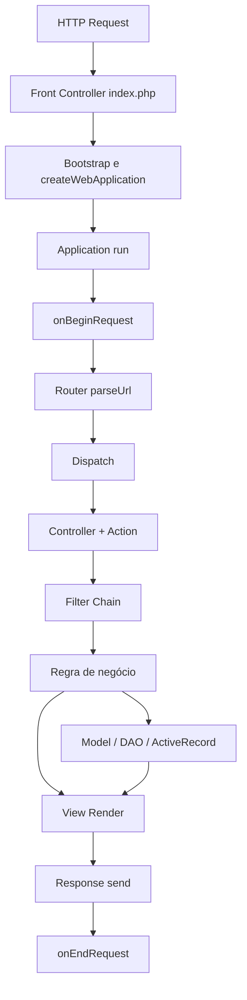

# php2go-study

Fork criado para **estudo** do framework **php2go** (PHP clássico desenvolvido por **Marcos Pont**), com foco em entender decisões arquiteturais, o ciclo **request → response**, pontos de extensão e padrões aplicados ao longo do tempo.
  
> ⚠️ Nota: este repositório é voltado para estudo histórico/arquitetural — não é uma recomendação de uso em produção moderna sem modernização e revisão de segurança/tooling.

---

## Sumário

- [Por que este fork existe?](#por-que-este-fork-existe)
- [Estrutura do projeto](#estrutura-do-projeto)
- [Análise técnica](#-análise-técnica)
- [Request lifecycle (diagrama)](#request-lifecycle-diagrama)
- [Créditos / Referências](#créditos--referências)

---

## Por que este fork existe?

Eu analisei o framework com a intenção de aprender **como ele “pensa”**:

- como o pipeline web é estruturado (Front Controller → Router → Controller/Action → View → Response)
- como eventos e filtros ajudam a separar responsabilidades (cross-cutting concerns)
- como a camada de dados (ActiveRecord/DAO) se integra ao fluxo

---

## Estrutura do projeto

- `demo/`: aplicação de exemplo (front controller, bootstrap, controllers, models, views, configs)
- `php2go/`: núcleo do framework (`Application`, `WebApplication`, `Router`, `Controller`, `View`, `ActiveRecord`, `DAO`, `Auth`, `Cache` etc.)
- `tests/`: scripts de validação

---

## 📌 Análise técnica

A análise completa está disponível aqui:

- **[Análise Técnica do php2go](./analise_tecnica_php2go.md)**

---

## Request lifecycle (diagrama)

## Créditos / Referências

- Autor original: [Marcos Pont](https://github.com/marcospont)
- Repositório upstream: [`marcospont/php2go`](https://github.com/marcospont/php2go)
- Este fork (estudo): [`john-dalmolin/php2go-study`](https://github.com/john-dalmolin/php2go-study)
