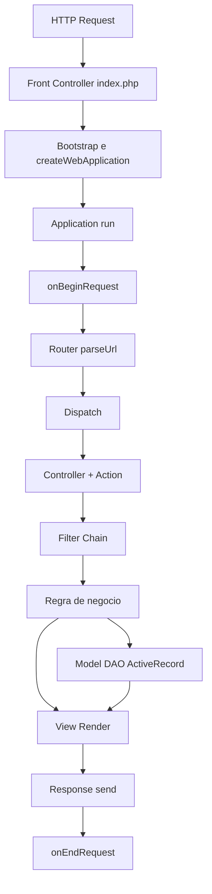

# Análise Técnica do php2go

Autor: [John Dalmolin](https://github.com/john-dalmolin)
Data: 8 de fevereiro de 2026

## Contexto da análise

Estudei o `php2go` com foco em entender como o framework "pensa": o ciclo request-response, os pontos de extensão e como as responsabilidades se encaixam no desenho geral.

O que mais chama atenção é que não é apenas um projeto que "funciona". Ele foi estruturado como plataforma, com uma arquitetura surpreendentemente completa para a época.

## 1) Organização do framework

A estrutura segue um padrão clássico e bem legível de framework full-stack:

- `demo/`: aplicação exemplo (front controller, bootstrap, controllers, models, views, configs)
- `php2go/`: núcleo do framework (`Application`, `WebApplication`, `Router`, `Controller`, `View`, `ActiveRecord`, `DAO`, `Auth`, `Cache` etc.)
- `tests/`: scripts de validação

No centro do desenho está a classe `Php2Go`, responsável por:

- resolver aliases/imports e autoload
- criar instâncias via configuração (`factory`)
- inicializar aplicações web e console

Esse "core object" deixa clara uma decisão de arquitetura: padronizar bootstrap e criação de objetos, mantendo o resto do sistema extensível.

## 2) Fluxo de execução (request -> response)

O ciclo principal de uma request web está bem definido e previsível:

1. Apache redireciona para `index.php` (front controller)
2. `bootstrap.php` carrega o core e cria a `WebApplication` via configuração
3. Dispara `onBeginRequest`
4. `Router` faz parse da URL e resolve rota
5. `dispatch` encontra controller e action
6. Executa cadeia de filtros (ex.: autorização, regras HTTP)
7. Action roda a lógica de negócio
8. Model/DAO/ActiveRecord acessa dados quando necessário
9. View renderiza template e aplica layout
10. Response monta headers/body e envia
11. Dispara `onEndRequest`

### Pipeline (Mermaid)

## 3) Decisões arquiteturais que se destacam

Considerando o contexto histórico do projeto, os principais destaques são:

- MVC completo com front controller, roteamento e dispatch
- eventos + filtros no ciclo de request (boa separação de cross-cutting concerns)
- extensibilidade por configuração de componentes/factory
- camada de dados rica com `ActiveRecord` (validações, relacionamentos e behaviors)
- produtividade no view layer com helpers e widgets

O conjunto sugere um framework construído com mentalidade de manutenção e evolução, e não apenas para entrega rápida.

## 4) Leitura equilibrada: forças e pontos de modernização

Dá para reconhecer duas verdades ao mesmo tempo:

- a base é sólida e coerente, por isso continua valiosa para estudo
- é uma geração anterior do ecossistema PHP, então algumas escolhas pedem atualização hoje

Se a proposta for modernizar com cuidado, os pontos mais naturais seriam:

- segurança alinhada a práticas atuais
- atualização de tooling e fluxo de qualidade (testes automatizados, CI, lint)
- redução de acoplamentos globais/estáticos onde fizer sentido
- contratos mais explícitos em pontos centrais (router, response, auth, cache)

O ponto importante é que esse tipo de modernização só acontece sem trauma quando a arquitetura base é consistente.
E aqui ela é :)

## Conclusão

O `php2go` é um **excelente** material para entender fundamentos de frameworks PHP clássicos e **aplicação pragmática** de **padrões de arquitetura**.

O projeto transmite **intenção arquitetural**, **organização** e **preocupação com extensibilidade**, com um nível que impressiona bastante para o período em que foi evoluído.

Além do valor histórico, o estudo reforça fundamentos que continuam atuais: pipeline previsível, separação clara de responsabilidades e pontos de extensão bem posicionados.
Isso torna o código útil não só para “ver como era feito”, mas para aprender **decisões arquiteturais** que ainda se sustentam hoje.

No fim, essa análise deixa uma impressão muito positiva: é um trabalho maduro, bem pensado e **didaticamente rico** para quem leva engenharia de software a sério.

## Referências

- Autor original: [Marcos Pont](https://github.com/marcospont)
- Repositório analisado (fork): [john-dalmolin/php2go-study](https://github.com/john-dalmolin/php2go-study)
- Repositório upstream: [marcospont/php2go](https://github.com/marcospont/php2go)
- Último commit visível no histórico do código: 13 Jun 2015
